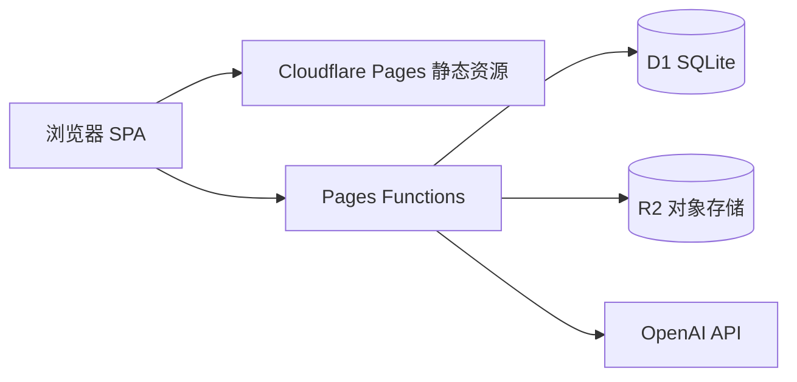

# 系统架构

## 概览



花园助手是**纯前端 SPA + Edge API** 架构：无自建 Node 长驻服务。用户通过邮箱登录后，所有业务数据经 Cookie 会话访问 D1；图片经 R2 存储。

## 技术选型

| 层级 | 技术 | 说明 |
|------|------|------|
| UI | React 19 + Vite 8 + Tailwind 3 | `src/`，构建输出 `dist/` |
| 路由 | React Router 7 | `BrowserRouter`；Pages 配置 SPA 回退 |
| API | Cloudflare Pages Functions | `functions/api/**` |
| 数据库 | Cloudflare D1 | binding `DB` |
| 文件 | Cloudflare R2 | binding `BUCKET`，路径 `{userId}/{uuid}.ext` |
| AI | OpenAI Chat Completions | `gpt-4o-mini`，binding 环境变量 `OPENAI_API_KEY` |

## 认证与数据隔离

- 会话：Cookie `ga_session`（HttpOnly，30 天），见 `functions/api/auth/`。
- `/api/data/*`、`/api/upload`、R2 资源读取均需有效会话。
- 植物及关联记录通过 `plants.user_id` 隔离；模板与天气按 `user_id` 存储。

## 前端页面与路由

| 路径 | 组件 | 认证 |
|------|------|------|
| `/login`, `/register` | Login, Register | 公开 |
| `/` | Dashboard | 需登录 |
| `/plants` | PlantList | 需登录 |
| `/plants/new`, `/plants/:id/edit` | PlantForm | 需登录 |
| `/plants/:id` | PlantDetail | 需登录 |
| `/tasks` | Tasks | 需登录 |
| `/calendar` | Calendar | 需登录 |
| `/settings` | Settings | 需登录 |

`App.tsx` 中 `RequireAuth` 包裹主布局；未登录重定向 `/login`。

## 后端模块划分

| 路径 | 职责 |
|------|------|
| `functions/api/auth/[[path]].ts` | 注册、登录、退出、/me、改密 |
| `functions/api/data/[[path]].ts` | 植物/记录/计划/待办/设置/天气 |
| `functions/api/data/schedule-algorithm.ts` | 待办日期纯函数（含 Vitest） |
| `functions/api/ai/*.ts` | advice、identify、care-plan |
| `functions/api/upload.ts` | 图片上传 |
| `functions/api/assets/[[path]].ts` | R2 代理下载 |

## 前端数据访问层

- **`src/lib/storage-api.ts`**：唯一数据入口，`fetch('/api/data/...', { credentials: 'include' })`。
- **`src/lib/auth-api.ts`**：认证 API。
- **`src/lib/api.ts`**：AI 接口（需登录，`credentials: 'include'`）。
- **`src/lib/user-settings.ts`**：重导出 `storage-api` 的设置读写（勿另开 fetch 路径）。
- **`src/lib/calendar-timezone.ts`**：IANA 时区、月历网格、YMD 转换。

> **注意**：README 中「D1 失败回退 localStorage」的描述已过时；当前实现**仅 D1**，见 requirements §4.1、§10.1。

## 部署配置（wrangler.toml）

- `pages_build_output_dir = "./dist"`
- `[[d1_databases]]` → `DB`
- `[[r2_buckets]]` → `BUCKET`

生产环境另需在 Cloudflare Dashboard 配置 `OPENAI_API_KEY` 及 Pages 与 D1/R2 绑定（若未通过 wrangler 自动关联）。

## 关键跨切面

| 主题 | 实现位置 |
|------|----------|
| Markdown 备注 | `MarkdownView` / `MarkdownTextarea`，remark-gfm |
| 图片压缩（识别） | `src/lib/compress-image.ts`，>1MB 压缩 |
| 待办完成乐观 UI | `Tasks.tsx` + `pendingHideRowKeysRef` |
| 品种共享计划 | `care_schedule_templates` + `variety_key`，见 [db-schema.md](./db-schema.md) |
| 待办算法 | [schedule-algorithm.md](./schedule-algorithm.md) |
| 事件模型 | [event-model.md](./event-model.md)（无消息队列，读时计算） |

## 本地开发与部署

### 前置条件

- Node.js（与 `package.json` 兼容的 LTS）
- Cloudflare 账号（D1、R2、Pages）
- OpenAI API Key（AI 功能）

### 本地命令

```bash
npm install
npm run dev          # 仅 Vite 前端（API 不可用）
npm run dev:full     # 构建后 wrangler pages dev（含 Functions / D1 / R2，需 .dev.vars）
npm test             # Vitest
npm run test:coverage
npm run build        # tsc + vite build → dist/
npm run deploy       # build + wrangler pages deploy
```

调试 **API / D1 / R2** 建议使用 `npm run dev:full` 或 `npx wrangler pages dev dist`（需先 `npm run build`），并加载 `.dev.vars`。

### 环境变量

| 变量 | 位置 | 用途 |
|------|------|------|
| `OPENAI_API_KEY` | `.env` / `.dev.vars` / Pages Dashboard | AI 接口 |
| D1 `DB` | `wrangler.toml` binding | 数据 API |
| R2 `BUCKET` | `wrangler.toml` binding | 图片上传 |

### 数据库迁移

1. 在 `wrangler.toml` 配置 `database_id`
2. 执行：`npx wrangler d1 migrations apply <database_name>`

迁移文件按 `migrations/0001_*.sql` 递增；**不要修改已应用的历史文件**。

### 实现注意事项

1. **数据层**：仅通过 `src/lib/storage-api.ts` 访问后端。
2. **认证**：数据与 AI 请求带 `credentials: 'include'`。
3. **共享计划删除**：前端区分 `scope`，提示影响范围。
4. **测试**：改 `schedule-algorithm.ts` / `due-tasks.ts` 时跑 `npm test`；覆盖率门禁见 `vite.config.ts`。
