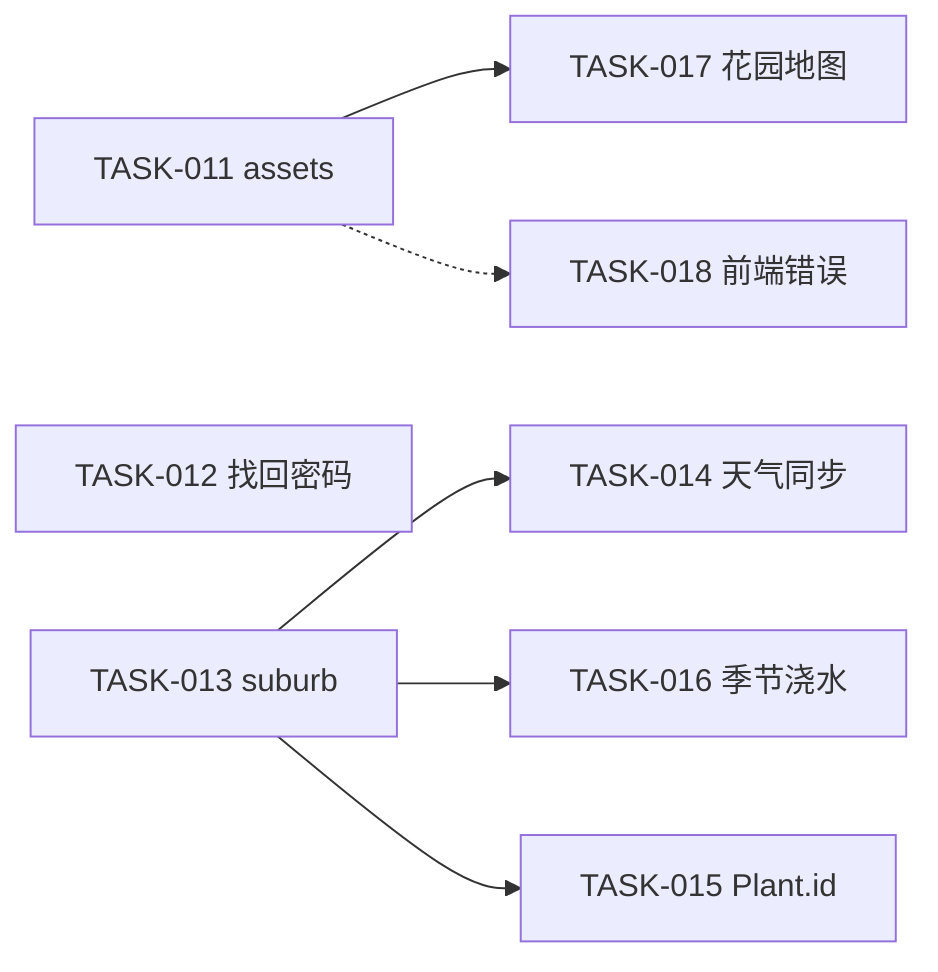

# 合规审计与迁移报告

| 项目 | 说明 |
|------|------|
| 权威基准 | [`AGENTS.md`](../../AGENTS.md)、[`product-spec.md`](../requirements/product-spec.md) **v1.1**、[`planned-v1.1.md`](../requirements/planned-v1.1.md) |
| 审计范围 | `src/`、`functions/`、`tests/`（不含 `node_modules`） |
| v1.0 迁移 | 2026-05-19 完成（TASK-001 … TASK-010） |
| **v1.1 审计** | **2026-05-19**（本文 §9 起） |
| 结论摘要 | v1.0 已修复；v1.1 主干（TASK-011～017）已实现；**验收差距**见 TASK-019～027 |

---

## 目录

1. [v1.0 实施后状态（已完成）](#1-v10-实施后状态已完成)
2. [v1.1 审计方法](#2-v11-审计方法)
3. [违规与差距清单](#3-违规与差距清单)
4. [影响分析](#4-影响分析)
5. [迁移计划（v1.1）](#5-迁移计划v11)
6. [风险与回滚](#6-风险与回滚)
7. [任务分解](#7-任务分解)
8. [建议排期](#8-建议排期)
9. [审计后文档同步](#9-审计后文档同步)

---

## 1. v1.0 实施后状态（已完成）

| 违规 ID | 处理 |
|---------|------|
| V-001–V-004 | `due-tasks.ts` 统一待办/计数/日历；`care-logs/date` 支持 `tzOffsetMinutes` |
| V-101 | `getUserSettings` / `setUserSettings` 并入 `storage-api.ts` |
| V-102 | 删除 `POST /api/data/import` |
| V-103 | AI 接口需登录 + `credentials: 'include'` |
| V-104 | `care-plan` 支持 `intervalDays: 0` |
| V-201–V-202 | 中文标签与归档对话框 |
| V-301–V-302 | 文档路径与 PLAN 历史横幅 |
| V-204 | `npm run dev:full` |

历史细节见 git 历史或 `docs/tasks/TASK-001` … `TASK-010`。

---

## 2. v1.1 审计方法

对照 **AGENTS.md「已实现 vs 规划」** 与 **product-spec §3.14～§3.15**，逐项检查代码是否存在规划能力；并复查 AGENTS **编码约定**（`ApiError`、加载错误展示、禁止 localStorage 等）。

工具：全库 grep、`functions/api/**` 与 `src/pages/*` 对照阅读。

---

## 3. 违规与差距清单

严重程度：**P0** 安全或数据泄露 · **P1** 账户/核心体验 · **P2** 产品差异化 · **P3** 编码约定/可维护性（非功能缺口）

### 3.1 P0 — 安全（product-spec §3.14.2 / NFR-14）

| ID | 位置 | 违规说明 | 对照规则 |
|----|------|----------|----------|
| **V11-001** | `functions/api/assets/[[path]].ts` | `GET /api/assets/{key}` **无** `getCurrentUser` / `requireSessionUser`；任意人持 URL 可读 R2 对象（含 `{userId}/{uuid}.jpg`）。CORS 回显 Origin 但未校验 Cookie。 | product-spec §3.14.2 ASSET-01～04；AGENTS「assets 无会话校验」；`auth-flow.md` |
| **V11-002** | `src/pages/PlantList.tsx`、`PlantDetail.tsx` 等 `` | 图片 URL 为可猜测路径；在 V11-001 未修复前，**分享链接即泄露**。鉴权后需确认同源 `` 仍带 Cookie（同站一般可）。 | ASSET-03；验收 §11「仅本人可读」 |

### 3.2 P1 — 账户与体验（§3.14.1、§3.14.5～6）

| ID | 位置 | 违规说明 | 对照规则 |
|----|------|----------|----------|
| **V11-003** | `functions/api/auth/[[path]].ts` | 无 `forgot-password` / `reset-password` 路由与 `password_reset_tokens` 表。 | §3.14.1 AUTH-07/08 |
| **V11-004** | `src/App.tsx` | 无 `/forgot-password`、`/reset-password` 路由；`Login.tsx` 无「忘记密码」入口。 | §3.1 路由表 |
| **V11-005** | `migrations/*`、`user_settings` / `plants` 行映射 | 无 `suburb`、`latitude`、`longitude` 列；`GET/PUT /settings` 仅 `location`、`timeZone`。 | §3.14.5 SET-05/06、LOC-01 |
| **V11-006** | `src/pages/Settings.tsx`、`PlantForm.tsx`、`PlantList.tsx` | 无 suburb 输入、筛选、按 suburb 分组。 | LOC-02、PLANT-02（规划） |
| **V11-007** | `functions/api/data/[[path]].ts` | 无 `POST /weather/sync`；`daily_weather` 仅手填 PUT。 | §3.14.6 CAL-06/07、WEATHER-01 |
| **V11-008** | `src/pages/Calendar.tsx` | 仅 `getWeatherForRange` + 表单编辑；无打开月视图时触发同步。 | §3.14.6 |

### 3.3 P2 — 核心差异（§3.14.3～4、§3.14.7）

| ID | 位置 | 违规说明 | 对照规则 |
|----|------|----------|----------|
| **V11-009** | `functions/api/ai/identify.ts`、`src/lib/api.ts` | 识别**仅** OpenAI Vision；无 Plant.id 代理、`PLANT_ID_API_KEY`、降级策略。 | §3.14.3 PLANT-AI-05～08、ID-01～04 |
| **V11-010** | `schedule-algorithm.ts`、`due-tasks.ts`、计划 CRUD | 无 `seasonalWateringAdjust`、月份系数、`effectiveInterval`。 | §3.14.4 SCHED-04～06 |
| **V11-011** | 全库 | 无 `garden_maps` 表、`GET/PUT /garden-map`、`map_x`/`map_y`、`/garden-map` 页面、`upload/garden-map`。 | §3.14.7、§3.15 MAP-01～05 |
| **V11-012** | `functions/api/ai/*.ts` | 无按用户/IP 限流（规划 NFR-15 对 Plant.id/邮件亦适用）。 | §3.14 NFR-15（建议随各 TASK 分步） |

### 3.4 P3 — AGENTS 编码约定残留（非 §3.14 功能项）

| ID | 位置 | 违规说明 | 对照规则 |
|----|------|----------|----------|
| **V-401** | `Calendar.tsx` L61–64 | `getUserSettings().catch(() => {})` **静默吞掉**设置加载失败。 | AGENTS §7「勿静默吞掉 getUserSettings 失败」 |
| **V-402** | `Calendar.tsx` L67–89 | `getAllPlants` 与 `Promise.all(getDueTasksForDate…)` **无** `.catch`，失败时界面空白无提示。 | AGENTS §7（Dashboard/Tasks/PlantDetail 已有 `loadError`） |
| **V-403** | `PlantList.tsx` L11–12 | `getAllPlants().then(setPlants)` 无错误状态。 | 同上 |
| **V-404** | `PlantDetail.tsx` L130 | `getUserSettings().catch(() => {})` 静默失败。 | AGENTS §7 |
| **V-405** | `src/lib/api.ts` | AI 请求抛 `Error` 而非 `ApiError`，与 `storage-api` / `auth-api` 不一致。 | AGENTS §7 |
| **V-406** | `Tasks.tsx` L178 | `setTaskType(e.target.value as any)`。 | 类型安全（非阻塞） |
| **V-407** | `assets/[[path]].ts` | 本地 `corsHeaders` 未复用 `_shared/session.ts`（实施 V11-001 时应一并统一）。 | 架构一致性 |

### 3.5 已通过项（v1.1 审计无违规）

| 检查项 | 结果 |
|--------|------|
| localStorage / sessionStorage 业务读写 | **未发现** |
| 前端 API Key（OpenAI / Plant.id / 邮件） | **未发现** |
| `POST /api/data/import` | **已删除** |
| AI / data / upload 会话校验 | **已实现**（`_shared/session.ts`） |
| auth 路由复用 shared session | **已实现** |
| 待办三端算法统一 | **已实现**（`due-tasks.ts` + 测试） |
| 登录 `from` 回跳 | **已实现**（`auth-redirect.ts`） |
| 归档中文、`mulch`→「铺盖」 | **已实现**（`archiveReasonLabel`） |
| `user-settings.ts` | 仅 **deprecated 再导出** → `storage-api` |

---

## 4. 影响分析

### 4.1 安全与用户信任（P0）

| 违规 | 场景 | 影响 |
|------|------|------|
| V11-001 / V11-002 | 用户上传植物照；URL 被转发或枚举 | **任意访客可读他人 R2 图片**；隐私与合规风险；违反验收 §11「用户 A 无法访问用户 B 数据」中对静态资源的隐含要求 |
| 修复后 | 旧 `` 书签 | 未登录显示 404；需确保同域 Cookie 随图片请求发送 |

### 4.2 账户与日常体验（P1）

| 违规 | 场景 | 影响 |
|------|------|------|
| V11-003/004 | 忘记密码 | 只能重新注册或人工处理，**流失与客服成本** |
| V11-005～008 | 非 UTC、细粒度气候 | 天气需手填；识别/季节规则缺少 suburb 坐标，**推荐准确度低** |

### 4.3 产品差异化（P2）

| 违规 | 场景 | 影响 |
|------|------|------|
| V11-009 | 拍照识别 | OpenAI 通用视觉，**非园艺专用**；成本与品种准确度不如 Plant.id |
| V11-010 | 南半球夏季浇水 | 固定 interval，**旱季可能浇不够/雨季过勤** |
| V11-011 | 多株布局 | 无法平面图总览，**大屏花园管理弱** |

### 4.4 开发与运维（P3）

| 违规 | 场景 | 影响 |
|------|------|------|
| V-401～405 | API 失败、设置缺失 | 日历/列表**静默空白**，排障困难 |
| V-407 | assets 鉴权 PR | 重复 CORS 逻辑易漏改 |

---

## 5. 迁移计划（v1.1）

原则：**先 P0 安全，再 P1 账户与数据基础（suburb 为天气/季节前置），再 P2 功能块**；每 TASK 独立 PR；仅改本仓库；schema 仅 **新增** migration。

### 阶段 F — 静态资源鉴权（P0，1 PR）

**TASK-011**

1. `assets/[[path]].ts` 使用 `requireSessionUser`；解析 key 首段 `userId` 与当前用户 id 比对，不符 404。
2. 复用 `_shared/session.ts` 的 `corsHeaders`。
3. 手工：用户 A 的 `photoUrl` 在用户 B 会话下 404；未登录 401。
4. 更新 `api-contracts.md`、`auth-flow.md`、AGENTS「已实现 vs 规划」表。

**依赖**：无。  
**阻塞**：无（应最先合并）。

### 阶段 G — 账户找回（P1，1～2 PR）

**TASK-012**

1. Migration：`password_reset_tokens`。
2. `POST /api/auth/forgot-password`、`reset-password`；邮件服务 env；防枚举文案；限流。
3. 页面 `/forgot-password`、`/reset-password`；Login 链接。
4. 更新 `auth-flow.md`、product-spec 验收项。

**依赖**：邮件 env（Resend/SendGrid 等）。  
**可与 F 并行**（不同文件）。

### 阶段 H — 位置 suburb 基础（P1，1 PR）

**TASK-013**

1. Migration：`user_settings.suburb, latitude, longitude`；`plants.suburb`（可选继承默认）。
2. API / `storage-api` / Settings、PlantForm、PlantList 分组或筛选。
3. 为 TASK-014/016 提供坐标（地理编码可 v1 简化为手填 + 可选预设表）。

**依赖**：无。  
**建议早于** TASK-014、TASK-016。

### 阶段 I — 天气自动同步（P1，1 PR）

**TASK-014**

1. `POST /api/data/weather/sync?from=&to=`；Open-Meteo（或同类）按 settings 坐标拉取。
2. `daily_weather.source` / `fetched_at` migration；用户 PUT 标 `user` 不被 sync 覆盖（产品规则见 spec）。
3. `Calendar.tsx` 月格加载时 debounce 触发 sync；保留手填表单。

**依赖**：TASK-013（推荐有 lat/lon；无则回退 location 城市级）。

### 阶段 J — Plant.id 识别（P2，1 PR）

**TASK-015**

1. `functions/api/ai/identify-plantid.ts`（或替换 identify 主路径）；`PLANT_ID_API_KEY`。
2. 映射 `suggested_name` → name/variety；可选 `external_plant_id` 入库。
3. 前端 PlantForm/Detail 默认走 Plant.id；失败手填 + 可配置 OpenAI 回退。
4. `api.ts` 与测试。

**依赖**：TASK-013（可选 lat/lon）。  
**与 TASK-016 可并行**。

### 阶段 K — 季节浇水（P2，1 PR）

**TASK-016**

1. Migration：计划/template `seasonal_watering_adjust`；系数配置（KV 或表）。
2. `due-tasks.ts` 在 `watering` 且开关开启时计算 `effectiveInterval`。
3. PlantDetail 计划 UI + `tests/season-watering.test.ts`（或扩展现有测试）。
4. `schedule-algorithm.md` 去掉「未实现」标记。

**依赖**：TASK-013（半球/气候带简化规则）。

### 阶段 L — 花园平面图（P2，1～2 PR）

**TASK-017**

1. Migration：`garden_maps`；`plants.map_x, map_y, garden_map_id`。
2. `GET/PUT /garden-map`、`PUT /plants/:id/map-position`、`POST /api/upload/garden-map`。
3. 页面 `/garden-map`、Nav 入口；拖拽落点。

**依赖**：TASK-011（平面图亦存 R2，须鉴权）。

### 阶段 M — 前端错误处理收敛（P3，1 PR，可与 F 后任意时刻）

**TASK-018**

1. Calendar / PlantList：`loadError` + `getErrorMessage`。
2. 移除 `getUserSettings` 空 `catch`。
3. `api.ts` 改用 `ApiError`；Tasks `taskType` 去掉 `as any`。

**依赖**：无。  
**建议**：在阶段 F 之后、大功能 PR 之前完成，减少静默失败干扰联调。

### 阶段依赖总览

---

## 6. 风险与回滚

| 阶段 | 风险 | 缓解 |
|------|------|------|
| F assets 鉴权 | 外链/爬虫直接访问图片失效；CDN 缓存公开 URL | 同域 Cookie；发布说明；404 代替 401 防枚举 |
| G 邮件 | 邮件进垃圾箱、限流过严 | 统一「若邮箱存在将发送」文案；staging 测 Resend |
| I 天气 sync | 第三方 API 不可用、写入覆盖用户手填 | `source=user` 不覆盖；失败仅 toast |
| J Plant.id | 配额/超时 | 回退 OpenAI 或手填；限流 |
| K 季节系数 | 待办数量突变 | 默认关；发布说明 |
| L 花园地图 | 大图 R2 成本 | 限制上传尺寸；复用 upload 鉴权 |

回滚：按 TASK 对应 PR revert；有 migration 的 TASK 保留表结构一般可接受（向前兼容），或追加 down migration（慎用，需用户确认）。

---

## 7. 任务分解

| 任务 ID | 标题 | 优先级 | 阶段 | 关联违规 |
|---------|------|--------|------|----------|
| [TASK-011](../tasks/TASK-011-assets-api-auth.md) | `/api/assets` 登录与 userId 校验 | P0 | F | V11-001, V11-002, V-407 |
| [TASK-012](../tasks/TASK-012-password-reset.md) | 找回密码（邮件 + token） | P1 | G | V11-003, V11-004 |
| [TASK-013](../tasks/TASK-013-suburb-location.md) | suburb 与坐标字段 | P1 | H | V11-005, V11-006 |
| [TASK-014](../tasks/TASK-014-weather-auto-sync.md) | 天气自动同步 | P1 | I | V11-007, V11-008 |
| [TASK-015](../tasks/TASK-015-plant-id-identify.md) | Plant.id 识别主通道 | P2 | J | V11-009 |
| [TASK-016](../tasks/TASK-016-seasonal-watering.md) | 季节浇水间隔调整 | P2 | K | V11-010 |
| [TASK-017](../tasks/TASK-017-garden-map.md) | 花园平面图与落点 | P2 | L | V11-011 |
| [TASK-018](../tasks/TASK-018-frontend-load-errors.md) | 前端加载错误与 ApiError | P3 | M | V-401～406 |

索引：[`docs/tasks/README.md`](../tasks/README.md)。

---

## 8. 建议排期（参考）

| 顺序 | 内容 | 预估 |
|------|------|------|
| 1 | TASK-011 + TASK-018 | 1 周 |
| 2 | TASK-012 | 1 周（含邮件联调） |
| 3 | TASK-013 → TASK-014 | 1～2 周 |
| 4 | TASK-015 ∥ TASK-016 | 2 周 |
| 5 | TASK-017 | 1～2 周 |

---

## 9. 审计后文档同步

每 TASK 合并后更新：

- `docs/requirements/product-spec.md`（将对应 §3.14 子节标为已实现）
- `docs/requirements/planned-v1.1.md` 状态列
- `docs/architecture/*` 与 `AGENTS.md`「已实现 vs 规划」
- product-spec §11 验收勾选

---

## 10. v1.1 验收差距与 TASK-019～027（2026-05-19）

对照 product-spec §11 审查：v1.0 **全部满足**；v1.1 **主干满足、细节部分满足**。

| 任务 ID | 标题 | 优先级 | 关闭的验收项 |
|---------|------|--------|--------------|
| [TASK-019](../tasks/TASK-019-password-reset-hardening.md) | 找回密码加固 | P1 | AUTH-08 全量作废 token、IP 限流 |
| [TASK-020](../tasks/TASK-020-plantid-polish.md) | Plant.id 补齐 | P2 | 置信度、external_plant_id |
| [TASK-021](../tasks/TASK-021-seasonal-watering-ui.md) | 季节浇水 UI | P2 | SEASON-04、SCHED-06 |
| [TASK-022](../tasks/TASK-022-suburb-geocode-grouping.md) | suburb/geocode | P1 | LOC-02/03、SET-06 |
| [TASK-023](../tasks/TASK-023-weather-sync-ux.md) | 天气同步 UX | P1 | WEATHER-01/04 |
| [TASK-024](../tasks/TASK-024-garden-map-ux.md) | 花园图交互 | P2 | MAP-02/05、入口 |
| [TASK-025](../tasks/TASK-025-frontend-errors-remainder.md) | 前端错误收尾 | P3 | PlantDetail 静默 catch |
| [TASK-026](../tasks/TASK-026-api-rate-limiting.md) | API 限流 | P2 | NFR-15 |
| [TASK-027](../tasks/TASK-027-product-spec-acceptance-sync.md) | 文档验收同步 | P3 | §11 勾选与 §3.14 状态 |

建议排期：**019+026 → 022 → 023 → 020∥021 → 024 → 025 → 027**。

---

*本报告 §3～§8 为 v1.1 初版审计；§10 为验收差距任务。staging 回归见 product-spec §11。*
