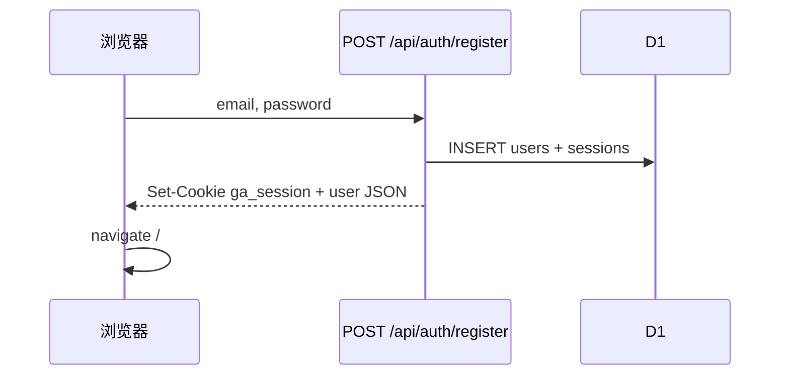
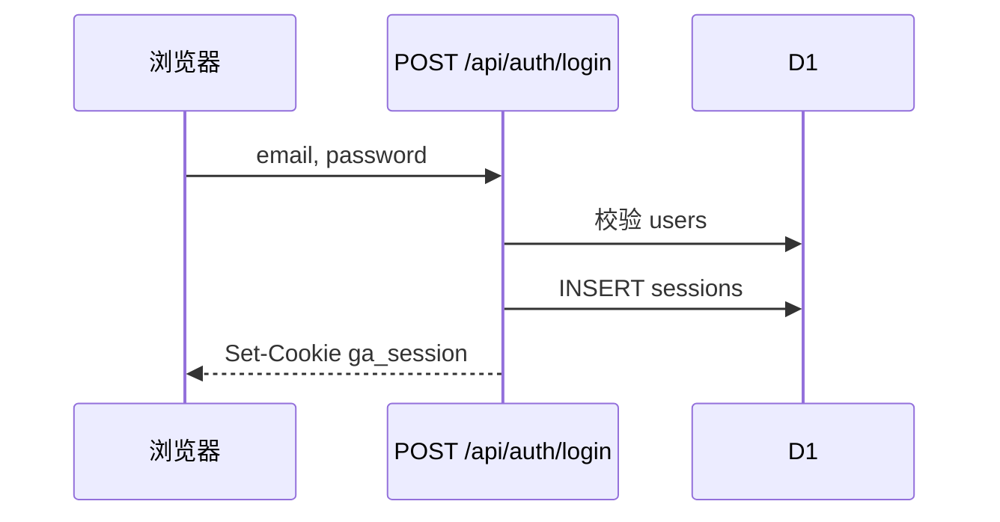

# 认证与会话流程

与 [`product-spec.md`](./product-spec.md) §2 对齐。实现见 `functions/api/auth/[[path]].ts`、`src/lib/auth-api.ts`、`src/App.tsx`（`RequireAuth`）。

## 会话模型

| 项 | 约定 |
|----|------|
| Cookie 名 | `ga_session` |
| 属性 | HttpOnly、`SameSite=Lax`、`Path=/`；HTTPS 下附加 `Secure` |
| 有效期 | 30 天（`Max-Age`） |
| 存储 | D1 `sessions` 表：`token`、`user_id`、`expires_at` |

## 流程

### 注册（AUTH-01）

- 密码：SHA-256(`salt` + `password`)，每用户独立 `salt`
- 成功后建立会话并进入首页

### 登录（AUTH-02）

### 退出（AUTH-03）

- `POST /api/auth/logout`：清除 Cookie（`Max-Age=0`）
- 前端 `Nav` 跳转 `/login`

### 受保护路由（AUTH-04）

1. `RequireAuth` 调用 `GET /api/auth/me`
2. 无会话 → `Navigate` 至 `/login`，`state.from` 保存当前路径
3. **已知缺口**：`Login.tsx` / `Register.tsx` 成功后固定跳转 `/`，未恢复 `from`

### 修改密码（AUTH-05）

- `POST /api/auth/change-password`：需当前密码；新密码 ≥ 6 位
- 设置页 `Settings.tsx` 表单校验两次输入一致

## 数据 API 鉴权

所有 `/api/data/*`、`/api/upload`、`/api/ai/*` 须有效会话，否则 **401** `{ error: '未登录' }` 或 AI `{ success: false, error }`。

前端统一：`fetch(..., { credentials: 'include' })`（`storage-api.ts`、`auth-api.ts`、`api.ts`）。

## 用户隔离

业务查询均带 `user_id`（来自 session 关联的 `users.id`）。跨用户资源 ID 访问返回 404/空，不泄露他用户数据。
