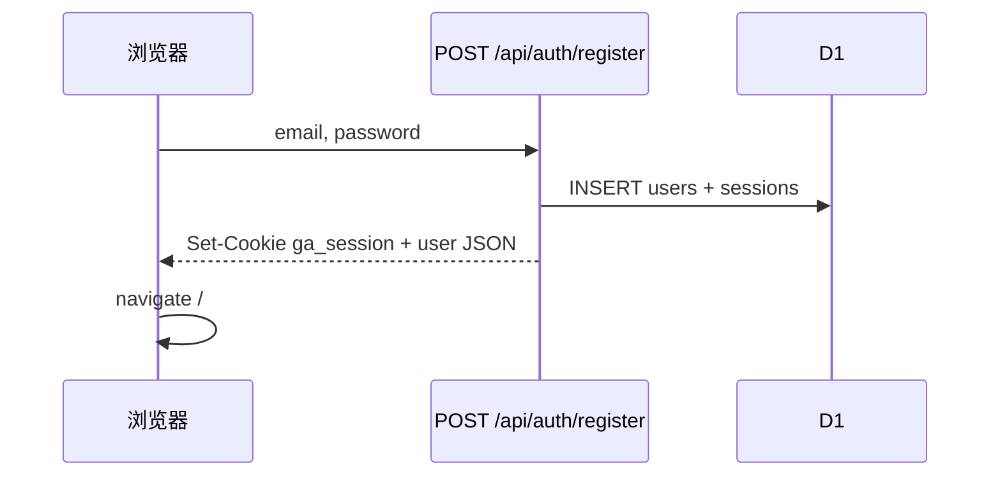
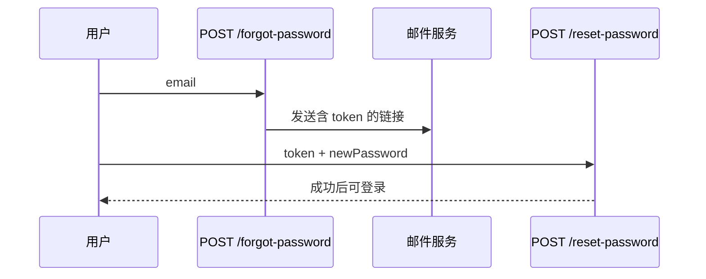

# 认证与会话流程

与 [`product-spec.md`](./product-spec.md) §2 对齐。实现见 `functions/api/_shared/session.ts`、`functions/api/auth/[[path]].ts`、`src/lib/auth-api.ts`、`src/App.tsx`（`RequireAuth`）、`src/lib/auth-redirect.ts`。

## 会话模型

| 项 | 约定 |
|----|------|
| Cookie 名 | `ga_session`（`SESSION_COOKIE`） |
| 属性 | HttpOnly、`SameSite=Lax`、`Path=/`；HTTPS 下附加 `Secure` |
| 有效期 | 30 天（`SESSION_TTL_DAYS`） |
| 存储 | D1 `sessions` 表：`token`、`user_id`、`expires_at` |
| 共享模块 | `getCurrentUser` / `getCurrentUserWithEmail` / `buildSessionSetCookie` / `corsHeaders` |

## 已实现流程

### 注册（AUTH-01）

- 密码：SHA-256(`salt` + `password`)，每用户独立 `salt`

### 登录（AUTH-02）

- `POST /api/auth/login` → 校验 users → 新建 session → `Set-Cookie`

### 退出（AUTH-03）

- `POST /api/auth/logout`：`getSessionToken` 删 D1 session → 清除 Cookie

### 受保护路由（AUTH-04）

1. `RequireAuth` → `GET /api/auth/me`
2. 无会话 → `/login`，`state.from` 保存路径
3. 登录/注册成功 → `resolvePostAuthPath(location.state)` 回跳（拒绝外链与 `/login`、`/register`）

### 修改密码（AUTH-05）

- `POST /api/auth/change-password`：需当前密码；新密码 ≥ 6 位；`Settings.tsx` 校验

## 规划：找回密码（AUTH-07 / AUTH-08）

> 详见 product-spec **§3.14.1**。**当前未实现**。

| 端点（规划） | 说明 |
|--------------|------|
| `POST /api/auth/forgot-password` | 限流；统一提示防邮箱枚举 |
| `POST /api/auth/reset-password` | 一次性 token；规则同 AUTH-05 |
| 页面 | `/forgot-password`、`/reset-password?token=` |

规划表：`password_reset_tokens`（或等价）；环境变量邮件服务（Resend/SendGrid 等）。

## 鉴权范围

| 路径 | 会话要求 | 说明 |
|------|----------|------|
| `/api/data/*` | 必须 | 401 `{ error: '未登录' }` |
| `/api/upload` | 必须 | 同上 |
| `/api/ai/*` | 必须 | 401 可为 `{ success: false, error }` |
| `/api/assets/*` | **当前无** | **规划** ASSET-01：须登录且 key 归属本人（§3.14.2） |

前端：`fetch(..., { credentials: 'include' })`。

## 用户隔离

业务数据按 `user_id` 隔离。跨用户 ID 返回 404/空，避免泄露存在性。
