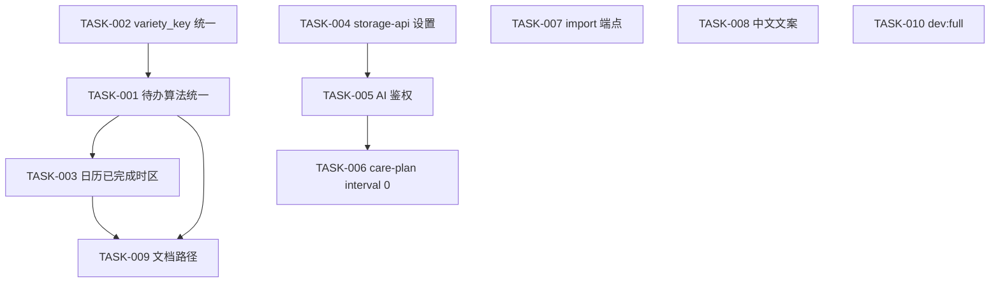

# 任务索引（TASK）

依据 [`MIGRATION-REPORT.md`](../decisions/MIGRATION-REPORT.md) 拆分的可执行任务。实施时**暂不编写无关代码**，按任务顺序推进并勾选验收标准。

## 状态说明

| 标记 | 含义 |
|------|------|
| ⬜ | 未开始 |
| 🟡 | 进行中 |
| ✅ | 已完成 |

## 任务列表

| ID | 文件 | 优先级 | 阶段 | 状态 |
|----|------|--------|------|------|
| TASK-001 | [TASK-001-due-algorithm-unification.md](./TASK-001-due-algorithm-unification.md) | P0 | A | ✅ |
| TASK-002 | [TASK-002-variety-key-unification.md](./TASK-002-variety-key-unification.md) | P0 | A | ✅ |
| TASK-003 | [TASK-003-calendar-care-logs-timezone.md](./TASK-003-calendar-care-logs-timezone.md) | P0 | B | ✅ |
| TASK-004 | [TASK-004-storage-api-settings.md](./TASK-004-storage-api-settings.md) | P1 | C | ✅ |
| TASK-005 | [TASK-005-ai-auth-and-cors.md](./TASK-005-ai-auth-and-cors.md) | P1 | D | ✅ |
| TASK-006 | [TASK-006-care-plan-interval-zero.md](./TASK-006-care-plan-interval-zero.md) | P1 | D | ✅ |
| TASK-007 | [TASK-007-legacy-import-endpoint.md](./TASK-007-legacy-import-endpoint.md) | P1 | D | ✅ |
| TASK-008 | [TASK-008-ui-chinese-copy.md](./TASK-008-ui-chinese-copy.md) | P2 | E | ✅ |
| TASK-009 | [TASK-009-docs-api-paths.md](./TASK-009-docs-api-paths.md) | P3 | E | ✅ |
| TASK-010 | [TASK-010-dev-workflow-script.md](./TASK-010-dev-workflow-script.md) | P2 | E | ✅ |

## 依赖关系

建议顺序：**TASK-002 → TASK-001 → TASK-003**；**TASK-004** 可与阶段 A 并行；**TASK-005 → TASK-006 → TASK-007**；最后 **TASK-008 / TASK-009 / TASK-010**。
