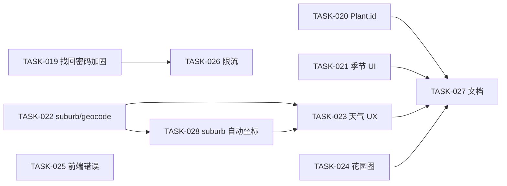

# 任务索引（TASK）

依据 [`MIGRATION-REPORT.md`](../decisions/MIGRATION-REPORT.md) 与 product-spec §11 验收差距拆分。

## 状态说明

| 标记 | 含义 |
|------|------|
| ⬜ | 未开始 |
| 🟡 | 进行中 / 部分满足 |
| ✅ | 已完成 |

## v1.0 合规（已完成）

| ID | 文件 | 状态 |
|----|------|------|
| TASK-001 … TASK-010 | 见 [MIGRATION-REPORT](../decisions/MIGRATION-REPORT.md) §1 | ✅ |

## v1.1 功能（已完成 2026-05-19）

| ID | 文件 | 状态 |
|----|------|------|
| TASK-011 | [TASK-011-assets-api-auth.md](./TASK-011-assets-api-auth.md) | ✅ |
| TASK-012 | [TASK-012-password-reset.md](./TASK-012-password-reset.md) | ✅ |
| TASK-013 | [TASK-013-suburb-location.md](./TASK-013-suburb-location.md) | ✅ |
| TASK-014 | [TASK-014-weather-auto-sync.md](./TASK-014-weather-auto-sync.md) | ✅ |
| TASK-015 | [TASK-015-plant-id-identify.md](./TASK-015-plant-id-identify.md) | ✅ |
| TASK-016 | [TASK-016-seasonal-watering.md](./TASK-016-seasonal-watering.md) | ✅ |
| TASK-017 | [TASK-017-garden-map.md](./TASK-017-garden-map.md) | ✅ |
| TASK-018 | [TASK-018-frontend-load-errors.md](./TASK-018-frontend-load-errors.md) | ✅ |

## v1.1 验收补齐（2026-05-19）

| ID | 文件 | 优先级 | 状态 |
|----|------|--------|------|
| TASK-019 | [TASK-019-password-reset-hardening.md](./TASK-019-password-reset-hardening.md) | P1 | ✅ |
| TASK-020 | [TASK-020-plantid-polish.md](./TASK-020-plantid-polish.md) | P2 | ✅ |
| TASK-021 | [TASK-021-seasonal-watering-ui.md](./TASK-021-seasonal-watering-ui.md) | P2 | ✅ |
| TASK-022 | [TASK-022-suburb-geocode-grouping.md](./TASK-022-suburb-geocode-grouping.md) | P1 | ✅ |
| TASK-023 | [TASK-023-weather-sync-ux.md](./TASK-023-weather-sync-ux.md) | P1 | ✅ |
| TASK-024 | [TASK-024-garden-map-ux.md](./TASK-024-garden-map-ux.md) | P2 | ✅ |
| TASK-025 | [TASK-025-frontend-errors-remainder.md](./TASK-025-frontend-errors-remainder.md) | P3 | ✅ |
| TASK-026 | [TASK-026-api-rate-limiting.md](./TASK-026-api-rate-limiting.md) | P2 | ✅ |
| TASK-027 | [TASK-027-product-spec-acceptance-sync.md](./TASK-027-product-spec-acceptance-sync.md) | P3 | ✅ |

## v1.1 后续增强（2026-05-21）

| ID | 文件 | 优先级 | 状态 |
|----|------|--------|------|
| TASK-028 | [TASK-028-suburb-auto-geocode-settings.md](./TASK-028-suburb-auto-geocode-settings.md) | P1 | ✅ |

**建议顺序**：`019` → `022` → `023` → `026`（可合并 019）；`020` ∥ `021`；`024`；`025`；最后 `027`（或每 PR 局部更新 spec）。

## 参考

- 差距来源：product-spec §11 验收审查（2026-05-19）
- 需求权威：[product-spec.md](../requirements/product-spec.md)
